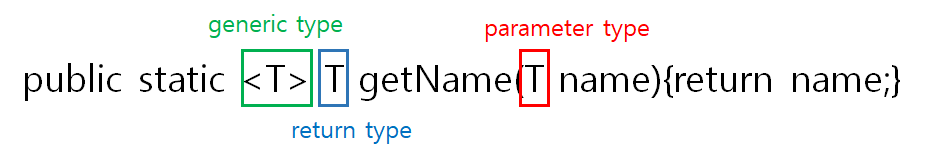

# Chapter 1
## 1.1 역사의 흐름

### java 8

가장 큰 변경점 : 스트림 API, 메서드에 코드 전달, 디폴트 메서드

스트림 API 때문에 메소드에 코드를 전달하는 기법이 생겼다는 추리 → 잘못됨

메소드에 코드를 전달하는 기법에 활용성을 제하날 수 있는 위험한 발상

## 1.2 자바가 왜 변화하는가

### 스트림 처리

한 번에 한 개씩 만들어지는 연속적인 데이터 항목들의 모임

리눅스 명령어 `|` 를 생각하면 편함, 어떤 출력은 어떤 입력이될 수 있음, 공장의 조립 라인 생각하기

고수준으로 추상화, 일련의 스트림으로 만들어 처리, 스레드 사용하지 않고 병렬성 확보

### 동적 파라미터화, 메서드 코드 전달

메서드를 메서드로 전달이 불가능, java 8은 동적 파라미터화해 전달한다.

### 병렬성, 순수 함수

병렬성을 얻은 대신, 안전하게 실행할 수 있어야 함

안전 확보 → 공유된 가변 data에 접근 하면 안됨 → 각 함수가 pure 함수(no-side-effect) 여야 함

`sychronized` ← 가변 data를 보호할 수 있지만 시스템에 악영향을 미침, 대신 스트림을 사용해 쉽게 병렬성을 확보

공유되지 않은 가변 데이터, 메서드, 함수 코드 → 함수형 프로그래밍의 핵심

## 1.3 자바 함수

자바에서 사용 가능한 형식 : 값, 함수

값 : 기본값(int, float), 객체(인스턴스) / 함수(매서드)

객체나 함수는 그 자체를 값으로 취급되지 않는다. 함수를 값 처럼 활용할 수 있게 해주어야 함

### 메서드 참조

`클래스::메서드` 이 메서드를 값으로 사용하라

매서드를 참조해 값으로 전달

### 람다(익명 함수)

메서드 참조를 사용할 편리한 클래스나 메서드가 없을 때 새로운 람다 함수를 사용하면 된다.

### 코드 넘겨주기

```java
public static List<Apple> filterGreenApples(List<Apple> inventory) {
        List<Apple> result = new ArrayList<Apple>();

        for(Apple apple: inventory) {
            if(GREEN.equals(apple.getColor())) { // 얘만 다름
                result.add(apple);
            }
        }
        return result;
    }

    public static List<Apple> filterHeavyApples(List<Apple> inventory) {
        List<Apple> result = new ArrayList<Apple>();

        for(Apple apple: inventory) {
            if(apple.getWeight() > 150) { // 얘만 다름
                result.add(apple);
            }
        }
        return result;
    }
```

코드 낭비다.

```java
public static boolean isGreenApple(Apple apple) {
  return "green".equals(apple.getColor());
}

public static boolean isHeavyApple(Apple apple) {
  return apple.getWeight() > 150;
}

public static List<Apple> filterApples(List<Apple> inventory, Predicate<Apple> p) {
  List<Apple> result = new ArrayList<>();
  for (Apple apple : inventory) {
    if (p.test(apple)) {
      result.add(apple);
    }
  }
  return result;
}

// 위와 같이 선언한 후
List<Apple> greenApples = filterApples(inventory, FilteringApples::isGreenApple);
// 한 줄로 표현 가능
```

### predicate

수학에서는 결과를 true나 false로 반환하는 함수를 `predicate`라고 한다.

`Function<Apple, Boolean>` 대신 `Predicate<Apple>` 이 더 좋다고 한다.

### 메서드 전달 → 람다로

```java
List<Apple> greenApples = filterApples(inventory, FilteringApples::isGreenApple);
// 이거를

List<Apple> greenApples = filterApples(inventory, (Apple a) -> "green".equals(apple.getColor()));
// 이렇게 표현 가능
```

그렇지만 람다가 길어지면, 람다가 아니라 이를 잘 설명하는 메서드를 정의하는 것이 좋다.

## 1.4 스트림

라이버러리 매소드 중에 filter가 있다, but 병렬성을 확보하지 못해 사용을 안함

for-each 루프를 사용해 요소를 반복하는 것은 `외부 반복` 인데

스트림을 사용해 요소를 반복하는 것은 `내부 반복` 이다.

외부 반복은 하나의 코어만 사용하는데, 내부 반복은 멀티 코어를 다 이용 가능함.

컬렉션의 필터링을 가장 빠르게 하는 방법은

컬렉션 → 스트림 → 병렬 처리 → 리스트로 복귀

```java
List<Apple> heavyApples = inventory.stream()
																.filter((Apple a) -> a.getWeight() > 150)
																.collect(toList());

List<Apple> heavyApples = inventory.parallelStream()
																.filter((Apple a) -> a.getWeight() > 150)
																.collect(toList());
```

## 1.5 디폴트 메서드, 자바 모듈

인터페이스를 구현한 클래스들은 인터페이스의 모든 메소드를 구현해야 함.

인터페이스에 새로운 메소드가 추가됨 → 이를 구현하고 있는 클래스들은 모두 구현해야함 → 솔직히 못함

구현하지 않아도 되는 메소드 == 디폴트 메소드

```java
default void sort(Comparator<? super E> c) {
	Collections.sort(this, c);
}
```

디폴트 메소드는 디폴트 메소드 정의가 있다. 구현하지 않으면 디폴트 메소드 정의대로 작동

## 1.6 함수형 프로그래밍의 핵심 아이디어

1. 메소드 참조, 람다를 이용해 일급값으로 활용
2. 가변 공유 상태 없는 병렬 실행 이용

# Chapter 2
## 동적 파라미터화

### To Dry

dry 법칙 : 코드를 반복해서는 안된다.

사과라는 객체에 대해 `초록색인지` 알고 싶거나, `무게가 150그램` 이 넘는다던가 알고 싶을 때, 이를 구현한다면 분명 중복되는 코드가 생긴다.

dry 법칙을 어기는 코드이기 때문에 좋다고 할 수 없다.

이를 해결해보자

### Interface 사용

```java
	public interface ApplePredicate {
      boolean test (Apple apple);
	}

  public class AppleHeavyWeightPredicate implements ApplePredicate {
      public boolean test(Apple apple) {
          return apple.getWeight() > 150;
      }
  }

  public class AppleGreenColorPredicate implements ApplePredicate {
      public boolean test(Apple apple) {
          return GREEN.equals(apple.getColor());
      }
  }

  public static List<Apple> filterApples(List<Apple> inventory, ApplePredicate p) {
      List<Apple> result = new ArrayList<>();
      for(Apple apple: inventory) {
          if(p.test(apple)) {
              result.add(apple);
          }
      }
      return result;
  }
```

구현할 기능의 메소드를 interface `ApplePredicate` 를 상속받는 객체로 감싼 후, 이 객체를 값으로 전달한다.

dry한 코드지만, 코드가 그래도 길다. 클래스로 정의하는 부분이 많기 때문에.

### 익명 클래스 사용

```java
public interface ApplePredicate {
    boolean test (Apple apple);
}

List<Apple> redApples = filterApples(inventory, new ApplePredicate() {
		public boolean test(Apple apple) {
				return RED.equals(apple.getColor());
		}
});
```

### 람다 포현식 사용

```java
List<Apple> redApples = filterApples(inventory, 
	(Apple apple) -> RED.equals(apple.getColor())
);
```

### \<T\>, 제네릭 타입 활용

```java
public interface Predicate<T> {
		boolean test(T t);
}

public static <T> List<T> filter(List<T> list, Predicate<T> p) { // 제네릭 메소드
		List<T> result = new ArrayList<>();
		for(T e: list) {
				if(p.test(e)) {
						result.add(e)
				}
		}
		return result;
}
```

Apple 뿐만 아니라 Banana 클래스, Melon 클래스 등 사용 가능하다.

!제네릭 메소드 공부!

### 실제 활용 - Runnable

thread 사용할 때 사용하는 Runnable 또한 동적 파라미터를 사용했다.

```java
// java.lang.Runnable
public interface Runnable {
		void run();
}

Thread t = new Thread(new Runnable() {
		public void run() { 대충 동작~~; }
});
```

Thread의 인자로 넘겨주는 값이 익명 클래스로 선언되었다.

### 실제 활용 - Callable
```java
// java.util.concurrent.Callable
public interface Callable<V> {
		V call();
}

ExecutorService executorService = Executors.newCachedTrheadPool();
Future<String> threadName = executorService.submit(new Callable<String>() {
		@Override
		public String call() throws Exception {
				return Thread.currentThread().getName();
		}
});
// or
Future<String> threadName = executorService.submit(
		() -> Thread.currentThread().getName()
);
```
# week 1 추가 공부
## 추가

### 함수형 인터페이스

1개의 추상 메소드를 가지고 있는 인터페이스

```java
interface CustomInterface<T> {
    // abstract method 오직 하나
    T myCall();

    // default method 는 존재해도 상관없음
    default void printDefault() {
        System.out.println("Hello Default");
    }

    // static method 는 존재해도 상관없음
    static void printStatic() {
        System.out.println("Hello Static");
    }
}
```

함수형 인터페이스를 사용하는 이유는 자바의 람다식은 함수형 인터페이스로만 접근이 되기 때문입니다.

```java
// 첫번째 예시
@FunctionalInterfac // 추상메소드 한개만 갖도록 강제한다!!
public interface FunctionalInterface {
     public abstract void doSomething(String text);
}

FunctionalInterface func = text -> System.out.println(text);

// 두번째 예시
@FunctionalInterfac // 추상메소드 한개만 갖도록 강제한다!!
interface Game{
	public abstract void play();
}

Game game2 = ()->{System.out.println("람다 표현식 1");};
game2.play();

Game game3 = ()->System.out.println("람다 표현식 2");
game3.play();
```

이런 식으로 딱 하나의 추상 메소드가 있으므로, 위와 같이 람다식을 넘겨주는 것으로, 그 추상 메소드를 정의한다.

java에서 사용하는 함수형 인터페이스는 6가지가 있다.

- Runnable / run()
- Consumer<T> / accept(T t)
- Supplier<T> / get()
- Function<T, R> / apply(T t) **/ 데이터 맵핑용, int받고 String반환같은**
- Operator<T> / 얜 종류가 여러개임 **/ 연산용도, 임의의 타입 전달하고 임의의 타입 반환**
- Predicate<T> / test(T t) **/ 임의의 타입 받고 boolean형 반환**

### 클래스와 인스턴스의 구분

클래스가 붕어빵을 만들기 위한 틀이라면

인스턴스는 틀로부터 만들어진 붕어빵 하나하나다.

### 제네릭 메소드

```java
public interface Predicate<T> {
		boolean test(T t);
}

public static <T> List<T> filter(List<T> list, Predicate<T> p) { // 제네릭 메소드
		List<T> result = new ArrayList<>();
		for(T e: list) {
				if(p.test(e)) {
						result.add(e)
				}
		}
		return result;
}
```

    

이래 생김

static 변수는 제너릭이 사용 불가다. static은 미리 메모리에 올라가는데, 무슨 타입인지 알 수 없기 때문이다. 그러나 제네릭 메소드는 static이 가능하다.