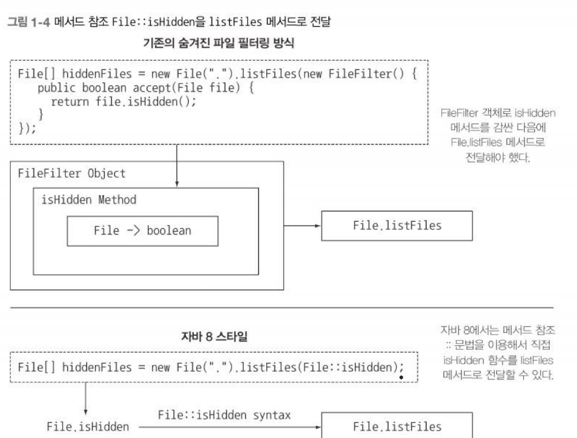

# Part1

# 1장. 자바 8, 9, 10, 11: 무슨 일이 일어나고 있는가?

## 1.1 역사의 흐름은 무엇인가?

- Java8에서 가장 큰 변화가 생김. ⇒ 간결한 코드, 멀티프로세서의 쉬운 활용
- Java5에서는 스레드풀, 병렬 실행 컬렉션(concurrent collection)을 도입
- Java7에서는 포크/조인 프레임워크 도입
- Java8에서는 이전과 다른 새로운 방식(함수형 프로그래밍)으로 병렬실행을 지원함. ⇒ 제대로 사용하려면 여러가지 규칙을 지켜야함.
- Java9에서는 리액티브 프로그래밍이라는 병렬 실행 기법을 지원하게 됨

## 1.2 왜 아직도 자바는 변화하는가?

- 수많은 프로그래밍언어사이에서 살아남기 위해 변화한다.
- 이제는 빅데이터에 직면하면서 멀티코어, 컴퓨터 클러스터를 이용해서 효율적으로 처리하는 요구사항이 생겼다. 즉, 병렬 프로세싱의 요구사항이 생겼다.
- 따라서 Java8에는 기존의 객체지향 프로그래밍과 사실상의 반대개념인 함수형프로그래밍을 도입했다.

### 스트림 처리

- 스트림이란 한 번에 한 개씩 만들어지는 연속적인 데이터 항목들의 모임이다.
- Java8에는 `java.util.stream` 패키지에 스트림 API가 추가됨.
- Stream<T>를 통해서 일종의 공장 파이프라인을 제공한다고 생각하자.
- 자세한 내용은 4~7장에서 다룬다.

### 동작 파라미터화로 메서드에 코드 전달하기

- 코드 일부를 API로 전달하는 기능이다.

```java
inventory.sort(comparing(Apple::getWeight));
```

- Apple 객체의 getWeight 코드를 API로 전달하고 있다.
- 자세한 내용은 2~3장, 18~29장에서 다룬다.

### 병렬성과 공유 가변 데이터

- 병렬성을 공짜로 얻게된다. 물론 공짜는 없다. 병렬성을 얻는 대신 코드 동작방식의 약간의 수정이 필요하다.
- 스트림 메서드로 전달하는 코드는 다른 코드와 동시에 실행되더라도 안전하게 실행될 수 있어야하며, 그러기 위해서는 공유 가변 데이터에 접근하지 말아야한다.
- 프언에서 배웠던 순수함수, stateless function이 그것이다! ⇒ 반갑다…
- 공유 데이터에 접근하는 두 코드가 있으면 synchronized를 통해서 해결해왔지만, 너무 비용이 비싸다. ⇒ 사실상의 mutex lock이니까.
- 이런 문제를 해결하는 방법은 1.4장에서 알아본다.

## 1.3 자바 함수

- 자바에서 “함수”는 **메서드**가 아니라 **순수 함수**를 의미한다. 즉, 부대효과가 없는 함수를 의미한다.
- Java8에서는 함수를 **값** 취급한다. 이로써 스트림에 연결될 수 있도록 만들었다.
- 프로그래밍언어에서 변경될 수 있는 **값**을 일급 시민, 
변경될 수 없는 메서드나 클래스등을 이급 시민으로 분류한다.
즉, 메서드나 클래스는 그 자체라 값이 될 수 없다.
- 그런데, 런타임에 메서드를 전달할 수 있는 방법을 고안해내면 이급 시민인 메서드를 일급 시민처럼 만들 수 있다.
( 클래스는 아직 자바에서 일급 시민으로 취급하지 않는 것 같다. JavaScript에서는 클래스를 일급 시민 취급한다고 언급하는 것 보니까…)

### 메서드와 람다를 일급 시민으로

- 스칼라와 그루비를 통해 메서드를 일급 취급하면 편하다는 것을 증명했다.
- Java8에서 메서드를 값 취급할 수 있는 기능을 추가하여 Stream같은 Java8 기능의 토대를 제공했다.

1. 메서드 참조

File 클래스를 통해 현재 디렉토리에 있는 숨겨진 파일이 아닌 모든 파일을 리스팅하는 코드를 짠다고 가정해보자. Java8 이전에는 아래와 같다.

```java
File[] hiddeneFiles = new File(".").listFiles(new FileFilter() {
	public boolean accept(File file) {
		return file.isHidden();
	}
});
```

고작 4줄의 코드이지만 무슨 일을 하는지 한 눈에 알아볼 수가 없다. 게다가 이미 isHidden이라는 메서드가 있는데 이걸 복잡하게 FileFilter로 감싸서 구현한다는 것이 좀 불합리해 보인다.

```java
File[] hiddenFiles = new File(".").listFiles(File::isHidden);
```

위 코드가 Java8을 활용한 코드이다. File::isHidden에서 “::”을 통해서 해당 메서드를 함수로 취급하겠다(함수와 메서드는 엄연히 다르다! 명심하자!)고 선언했다고 봐도 무방하다.

즉, 해당 메서드를 참조(reference)하여 가



1. 람다: 익명함수

Java8에서는 메서드를 일급값 취급할 뿐 아니라, 람다를 포함한 함수도 값으로 취급할 수 있다.(람다는 익명함수)

⇒ 워낙 잘 아는거고, 책에서도 자세히 다루지 않으니 패스!

### 예제

```cpp
public static List<Apple> filterGreenApples(List<Apple> inventory) {
	List<Apple> result = new ArrayList();
	for (Apple apple: inventory) {
		if (GREEN.equals(apple.getColor()) {
			result.add(apple);
		}
	}
}

public static List<Apple> filterHeavyApples(List<Apple> inventory) {
	List<Apple> result = new ArrayList();
	for (Apple apple: inventory) {
		if (apple.getWeight() > 150) {
			result.add(apple);
		}
	}
}
```

```cpp
public static boolean isGreenApple(Apple apple) {
	return GREEN.equals(apple.getColor());
}

public static boolean isHeavyApple(Apple apple) {
	return apple.getWeight() > 150;
}

public static List<Apple> filterApples(List<Apple> inventory, Predicate<Apple> p) {
	List<Apple> result = new ArrayList();
	for (Apple apple: inventory) {
		if (p.test(apple)) {
			result.add(apple);
		}
	}
}

filterApples(inventory, Apple::isGreenApple);
filterApples(inventory, Apple::isHeavyApple);
```

### Predicate

<aside>
💡 `Predicate`는 true 또는 false를 반환하는 Function을 의미한다. `Function<Apple, Boolean>`과 같다고 볼 수 있지만, Boolean을 boolean으로 변환하는 과정이 없고, 더 표준적인 방식이므로 Predicate를 전호한다.

</aside>

### 메서드 전달에서 람다로

- 앞서 살펴본 예제에서 `isGreenApple`과 `isHeavyApple`같은 필터링용 메서드를 매번 선언하는 것이 매우 귀찮다. 따라서 람다를 통해서 메서드 선언없이 해결이 가능하다.

```cpp
filterApples(inventory, (Apple a) -> GREEN.equals(a.getColor());
filterApples(inventory, (Apple a) -> a.getWeight() > 150));
filterApples(inventory, (Apple a) -> a.getWeight() < 80 || RED.equals(a.getColor());
```

- 이제 모든게 해결 된건가?? ⇒ Nope!!
- `static Collection<T> filter`메서드를 정의하여 구현할 수도 있었겠지만, 병렬문제는 해결되지 않는다. **왜냐하면,, 그냥 내부적으로는 for loop이기 때문에..!**
- 따라서, Stream을 도입하여 병렬성을 확보했다.

## 1.4 스트림

```java
Map<Currency, List<Transaction>> transactionsByCurrencies = new HashMap<>();
for (Transaction transaction :   transactions) {
	if (transaction.getPrice()  > 1000) {
		Currency currency = transaction. getCurrency();
		List<Transaction> transactionsForCurrency = transactionsByCurrencies,get(currency);
		if (transactionsForCurrency == null)  {
			transactionsForCurrency = new ArrayList<>(); 
			transactionsByCurrencies.put(currency, transactionsForCurrency);
		}
		transactionsForCurrency.add(transaction);
	}
}
```

```java
import static java,util.stream,CollectorsrgroupingBy;
Map<Currency, List<Transaction>> transactionsByCurrencies = transactions.stream()
	.filter((Transaction t) -> t, getPrice() > 1000)
	.collect(groupingBy(Transaction:: getCurrency));
```

- Stream으로 구현 시 반복문 없이 쉽게 구현이 가능하다. 이렇게 Stream 라이브러리 내부에서 처리하는 것을 **내부반복**이라고 한다. ⇒ 4장에서 다시 다룬다.

### 멀티스레딩은 어려워요.

- 멀티스레드로 인한 race condition쪽 내용은 생략할게요! ⇒ 너무 많이 봄..
- Stream API를 통해서 Collection을 이용했을 때 발생하는 **복잡함과 모호함, 그리고 멀티코어 활용 문제를 모두 해결했다.**
- 복잡함과 모호함을 잡기위해 도입한 개념의 일부는 아래와 같다.
    - Filtering
    - Extracting
    - Grouping
- 멀티코어를 활용하기 위해서 아래와 같은 절차로 실행한다.
    - Forking(리스트의 앞부분과 뒷부분을 절반으로 잘라서 CPU에게 할당)
    - 자신이 맡은 일을 CPU가 처리
    - 하나의 CPU가 두 결과를 합침
- 따라서, 컬렉션을 가장 빠르게 연산할 수 있는 방법은 아래와 같다.
    - Collection을 Stream으로 변환한다.
    - Stream을 병렬로 처리한다.
    - Stream을 Collection으로 변환한다.

```java
import static Java.util.stream.Collectors.toList; 
List<Apple> heavyApples = inventory.parallelStream()
	.fliter((Apple a) -> a.geWeight() > 150)
	.collect(toList());
```

## 1.5 디폴트 메서드와 자바 모듈

- Java8 이전에 자바는 자바 패키지 집합을 포함하는 jar파일을 통해서 외부 컴포넌트를 불러올 수 있도록 지원해왔다. 그런데, 패키지의 인터페이스를 바꾸면 그 하위 구현체들을 모두 바꾸어야하기 때문에 여간 불편한게 아니다.
- Java9 에서 **모듈**시스템을 도입하여 패키지의 집합을 **모듈**이라고 정의하고, 문서화와 모듈 확인 작업이 용이하게 만들었다.

- Java8에서 **디폴트 메서드**를 지원하게 됨으로써 인터페이스를 쉽게 바꿀 수 있도록 했다. 디폴트 메서드는 우리가 직접 작성할 일은 크게 많지 않은데, 구현에는 도움이 되지 않지만, 쉽게 변화할 수 있는 환경을 제공해준다(확장성이 커진다는 말이겠지??)
- 디폴트 메서드를 사용하면 기존의 코드를 고치지 않고도 이미 공개된 인터페이스를 변경할 수 있다. default 메서드를 사용하면 클래스 구현이 아니라, default 메서드의 코드는 인터페이스의 일부로 포함된다.
- 예를 들어, Java8 이전에는 `List<T>`를 구현하는 모든 클래스가 `sort`를 구현해야 했지만, Java8 부터는 `sort`를 구현하지 않아도 된다. 왜냐하면 `List<T>`인터페이스 안에 `sort`가 default 메서드로 구현되어 있기 때문이다.

```java
default void sort(Comparator<? super E> c) { 
	Collections.sort(this, c);
}
```

<aside>
💡 자, 그런데, 하나의 클래스가 여러 인터페이스를 상속할 수 있으니, 여러 default 메서드가 존재할 수 있다고 볼 수 있다. 그러면 여러 class를 상속받는 다이아몬드 상속 문제가 발생한다. 따라서, 9장에서 다이아몬드 상속 문제를 해결하는 방법을 설명한다고 한다.

</aside>

## 1.6 함수형 프로그래밍에서 가져온 다른 아이디어

- `Optional<T>`를 도입하여 NullPointer 예외를 피할 수 있게 제공한다.
- 패턴 매칭을 지원하기 위해 준비중이다.